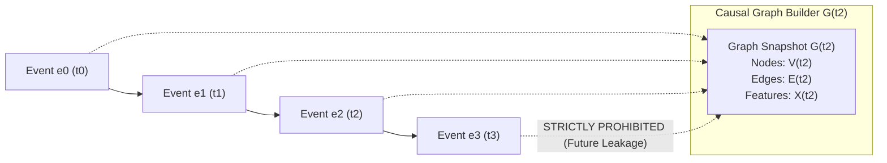

# AgentGuard — Temporal Graph Builder Documentation

## 1. Research Objective & Mathematical Definition

In multi-agent systems, cascading failures emerge from dynamic, distributed interaction patterns across agent networks. To predict impending failures at horizon $k$, the chronological event stream is mapped into a sequence of causal temporal interaction graphs:

$$G(t) = (V(t), E(t), X(t))$$

where:
* **$V(t)$**: The set of active agent nodes up to timestamp $t$.
* **$E(t) \subseteq V(t) \times V(t)$**: The set of directed communication interaction channels observed up to timestamp $t$.
* **$X(t) = \{X_V(t), X_E(t)\}$**: Attributed node feature matrix $X_V(t) \in \mathbb{R}^{|V| \times d_v}$ and edge feature tensor $X_E(t) \in \mathbb{R}^{|E| \times d_e}$.

### Future Failure Prediction Formulation
The prediction task is formulated as:

$$P\Big(F_{(t, t+k]} = 1 \;\Big|\; G(\le t)\Big)$$

where $F_{(t, t+k]}$ indicates whether a failure (local, interaction, or cascading) occurs in the forward horizon of $k$ interaction steps. 



---

## 2. Node Representation & Feature Specifications

Each node $v \in V(t)$ represents an individual agent participating in the workflow. Node features are aggregated strictly over causal interactions ($\le t$):

| Feature Name | Type | Description |
|---|---|---|
| `agent_id` | `str` | Unique agent identifier (e.g. `researcher_1`). |
| `role` | `str` | Functional role (`planner`, `researcher`, `analyst`, `coder`, `verifier`, `critic`, `decision`). |
| `is_active` | `bool` | Health/liveness status of agent node. |
| `event_count` | `int` | Total communication events involving this agent as source or target. |
| `message_count` | `int` | Number of message exchanges sent by this agent. |
| `tool_call_count` | `int` | Number of external tools invoked by this agent. |
| `error_count` | `int` | Cumulative tool errors, runtime exceptions, and failure events. |
| `retry_count` | `int` | Communication loops or retry queries initiated by agent. |
| `timeout_count` | `int` | Tool execution or response deadline timeouts. |
| `average_latency` | `float` | Mean latency (seconds) of sent responses. |
| `average_confidence` | `float` | Mean calibrated self-confidence score $\in [0, 1]$. |
| `average_output_quality` | `float` | Mean output quality metric $\in [0, 1]$. |
| `contradiction_rate` | `float` | Mean contradiction metric across prior communications $\in [0, 1]$. |
| `recent_failure_count` | `int` | Failures observed in the agent's most recent 5 actions. |

---

## 3. Edge Representation & Feature Specifications

Each directed edge $(u, v) \in E(t)$ represents direct communication flow from sender $u$ to recipient $v$. Edges preserve temporal interaction history rather than collapsing into static unweighted links:

| Feature Name | Type | Description |
|---|---|---|
| `source_agent` | `str` | Originating agent ID ($u$). |
| `target_agent` | `str` | Destination agent ID ($v$). |
| `interaction_count` | `int` | Cumulative number of communications sent along $u \rightarrow v$. |
| `message_count` | `int` | Number of task payloads exchanged along this edge. |
| `average_latency` | `float` | Mean transmission/processing latency for edge $u \rightarrow v$. |
| `average_message_length` | `float` | Average character length of exchanged payloads. |
| `average_confidence` | `float` | Mean confidence of payloads along this channel. |
| `retry_count` | `int` | Total retries or ping-pong queries along edge. |
| `contradiction_rate` | `float` | Mean contradiction score for assertions along edge. |
| `error_count` | `int` | Errors or failures occurring over this channel. |
| `timeout_count` | `int` | Deadline timeouts observed along this edge. |
| `last_interaction_time` | `float` | Timestamp of the most recent interaction along $u \rightarrow v$. |
| `interaction_frequency` | `float` | Normalized rate of interactions per unit trajectory time. |
| `interaction_timestamps` | `List[float]` | Chronological sequence of all interaction timestamps along $u \rightarrow v$. |

---

## 4. Event-to-Graph Mapping Policy

Events generated by the simulator map directly into graph attributes:

```
Telemetry Event Type       Graph Construction Impact
─────────────────────      ────────────────────────────────────────────────────
message                    Establishes/updates directed edge (src -> tgt)
delegation                 Establishes/updates directed edge (src -> tgt)
tool_call                  Updates source node tool_call_count and latency
tool_result                Updates source node quality and tool success
retry                      Increments node and edge retry_count
timeout                    Increments node and edge timeout_count, spikes latency
error                      Increments node and edge error_count
validation                 Updates average_output_quality and contradiction_rate
failure                    Increments failure counts, sets failure_label
```

---

## 5. Temporal Snapshot & Windowing Strategies

Snapshots $G(t)$ can be extracted under three configurable windowing policies:

1. **Cumulative Windowing (`cumulative`)**:
   Includes all historical events in $[0, t]$. Useful for long-term memory analysis.
2. **Event-Count Windowing (`event_count`)**:
   Includes only the last $W$ events up to $t$ (e.g. $W=5, 10, 20$). Focuses on local dynamic interactions.
3. **Time-Span Windowing (`time_span`)**:
   Includes events occurring within $[t - \Delta t, t]$. Filters out inactive historical channels.

### Historical Sequence Generation
For recurrent and temporal graph architectures (LSTM, TGN), the builder provides:

$$\mathcal{H}(t) = \big[ G(t - n\cdot\Delta), \dots, G(t - \Delta), G(t) \big]$$

via `build_temporal_history()`.

---

## 6. Data Leakage Prevention Guarantee

Scientific rigor requires that graph features $X(t)$ constructed for predicting failures at $t+k$ contain **zero future information**.

To guarantee this invariant:
1. Every event slice enforces $t_{\text{event}} \le t_{\text{snapshot}}$ and $\text{step}_{\text{event}} \le \text{step}_{\text{snapshot}}$.
2. The verification routine `verify_no_future_leakage()` is invoked during feature extraction, raising an immediate `ValueError` if any future step enters calculation.
3. Future prediction targets $Y_{t+k}$ are stored strictly in `snapshot.metadata["targets"]` without modifying node or edge feature vectors.

---

## 7. Serialization & Tensor Readiness

* **JSON Serialization**: `save_snapshot()` and `load_snapshot()` provide lossless round-trip persistence of nodes, edges, attributes, and metadata.
* **NetworkX Integration**: Every snapshot exposes a native `nx.DiGraph` with full attribute synchronization.
* **Tensor Conversion Prep**: `snapshot.node_feature_matrix()` and `snapshot.edge_index()` yield numerical arrays directly convertible to PyTorch Geometric (`torch_geometric.data.Data`) in subsequent ML phases.
